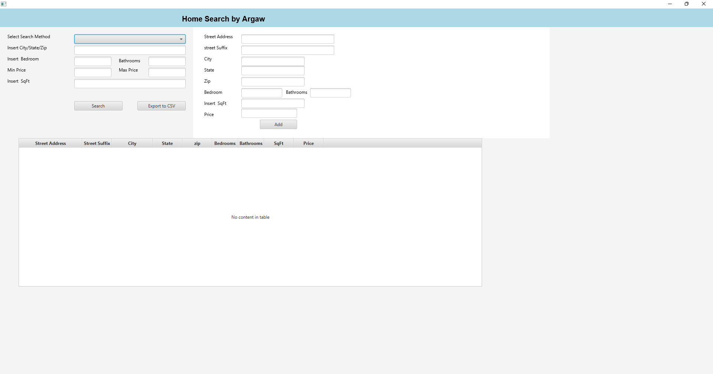
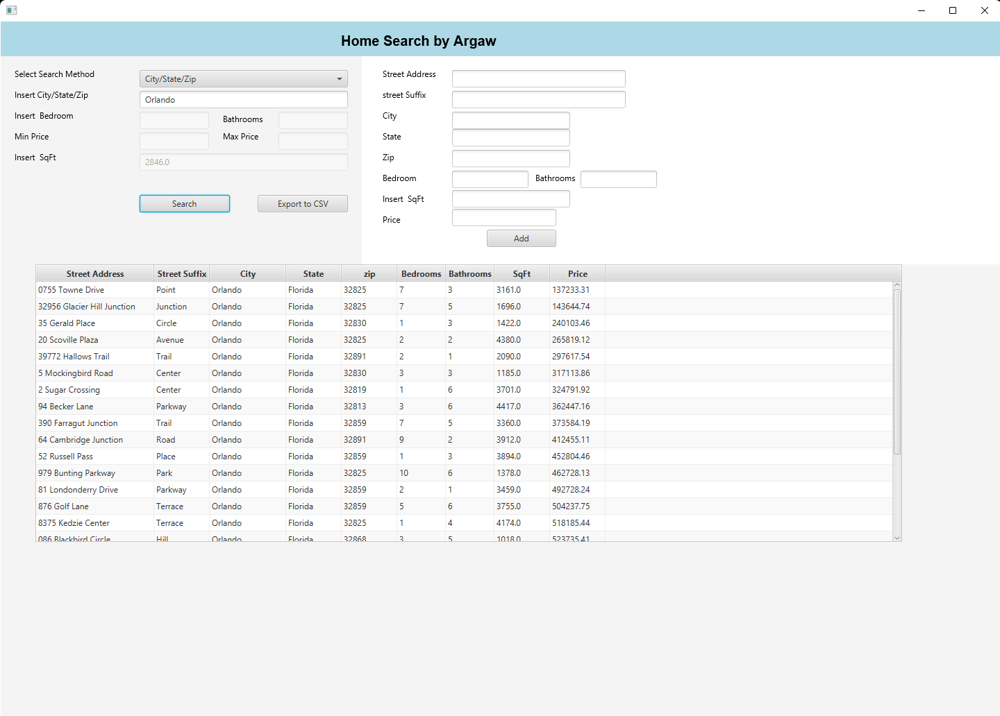
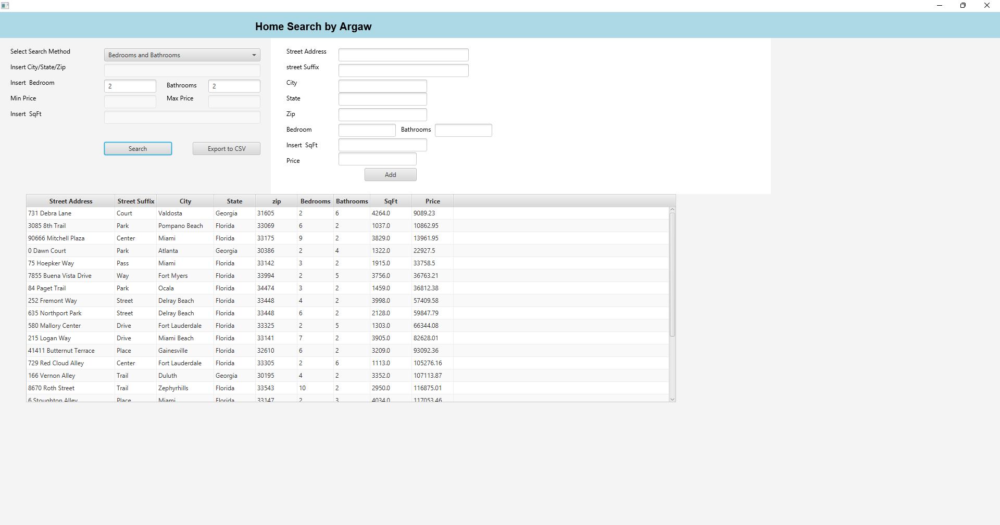

# 🏡 GUI Based Home Search Engine

This project is a comprehensive Home Search Engine application built with Java and the JavaFX framework. It allows users to view a collection of house data, perform various search operations, sort the data, and dynamically add new house properties.

---

## ✨ Features

- **Data Persistence**: The application reads house data from a `home_data.json` file on startup and saves any new additions back to the same file.  
- **Dynamic Property Addition**: A feature is implemented to allow the user to input details for a new property and add it to the live data set.  
  - **Input Validation**: All new property data is validated using methods in `ErrorValidation.java` to prevent bad or missing data from being added.  
- **Advanced Search Functionality**: Users can search the house listings using multiple criteria:  
  - City/State/Zip  
  - Number of Bedrooms and Bathrooms  
  - Minimum and Maximum Price Range  
  - Square Footage (SqFt)  
- **Data Sorting**: The application provides two different sorting algorithms for house listings based on the property price:  
  - Bubble Sort  
  - Merge Sort  
- **Error Logging**: Exceptions encountered during data reading or other processes are logged to an `error_log` file.  

---

## 💻 Technologies Used

| Technology | Purpose |
|------------|---------|
| Java | Core programming language. |
| JavaFX | Used for the Graphical User Interface (GUI) development. |
| JSON Simple (org.json.simple) | Library for parsing and writing JSON data (e.g., `home_data.json`). |
| JUnit 5 | Used for unit testing the model and service classes. |

---

## 📂 Project Structure

The project follows an Object-Oriented architecture, dividing responsibilities into distinct packages and classes.

| Class File | Package | Description |
|------------|---------|-------------|
| Main.java | `haile.arg.project.application` | The main class that sets up the JavaFX application, creates the GUI, handles user interaction, and integrates all service classes. |
| House.java | `haile.arg.project.model` | The Model class representing a single house property, containing fields like street address, city, zip, bedrooms, bathrooms, sqft, and price. |
| DataService.java | `haile.arg.project.service` | Utility class responsible for reading data from the `home_data.json` file and handling general application logging. |
| AddHouse.java | `haile.arg.project.service` | Service class with the logic to validate new house input and write the updated data list back to the JSON file. |
| ErrorValidation.java | `haile.arg.project.service` | Provides static validation methods for checking the correctness of user-inputted data fields (e.g., numeric checks, null/empty string checks). |
| Search.java | `haile.arg.project.service` | Contains the `searchHouse` method for filtering the list of houses based on various criteria. |
| Sort.java | `haile.arg.project.service` | Implements the Bubble Sort and Merge Sort algorithms to sort the house listings by price. |
| TestingHouseClass.java | `haile.arg.project.test` | JUnit tests to validate the House class constructor and its input constraints. |
| TestingSortClass.java | `haile.arg.project.test` | JUnit tests to verify the correctness of the sorting algorithms in `Sort.java`. |

---

## ▶️ How to Run the Application

This is a JavaFX application, and running it requires a Java Development Kit (JDK 11 or later, as JavaFX was decoupled from the JDK) and the JavaFX SDK configured with your IDE (e.g., IntelliJ IDEA, Eclipse, or NetBeans) or via the command line.

### Prerequisites

1. **JDK**: Java 11 or newer (LTS versions recommended).  
2. **JavaFX SDK**: Download and configure the appropriate JavaFX SDK for your platform.  
3. **home_data.json**: A mock data file in JSON format must be present in the project's root directory for the `DataService` to read the initial data.  

### IDE Setup (Recommended)

1. **Open Project**: Import the project into your IDE.  
2. **Configure JavaFX**: Add the JavaFX SDK as a library to your project structure.  
3. **VM Options**: Configure the module path to include the JavaFX libraries in your run configuration.  
   - **VM Arguments**:  
     ```
     --module-path /path/to/javafx-sdk/lib --add-modules javafx.controls,javafx.fxml,javafx.graphics
     ```
   *(Note: The exact path should be replaced with the location of your JavaFX SDK.)*  
4. **Run**: Execute the `Main.java` class located in the `haile.arg.project.application` package.  

---

## 🖼️ Screenshots

**Home Page and Data Entry**  
This is the application's initial interface, showing both the search input fields on the left and the new property addition form on the right.  


**Search by City/State/Zip**  
The application allows filtering the entire dataset by location.  


**Search by Bedrooms and Bathrooms**  
Users can filter the homes based on the number of bedrooms and bathrooms.  


**Search by Min/Max Price**  
A search can be narrowed down to a specific price range.  


---

## 🧪 Testing

The project includes unit tests using JUnit 5 to ensure the core logic operates correctly.  

- **House Model Tests**: `TestingHouseClass.java` validates that the House constructor enforces data integrity by checking for null, empty, or negative values for various properties like address, bedrooms, bathrooms, and price.  
- **Sorting Tests**: `TestingSortClass.java` includes tests to verify that both the Bubble Sort and Merge Sort algorithms correctly sort a sample data list of House objects by price.  

---

## References

You can find more advanced information on setting up JavaFX projects and their components in this video: *JavaFX and Scene Builder - Basic Java Search bar setup.*

